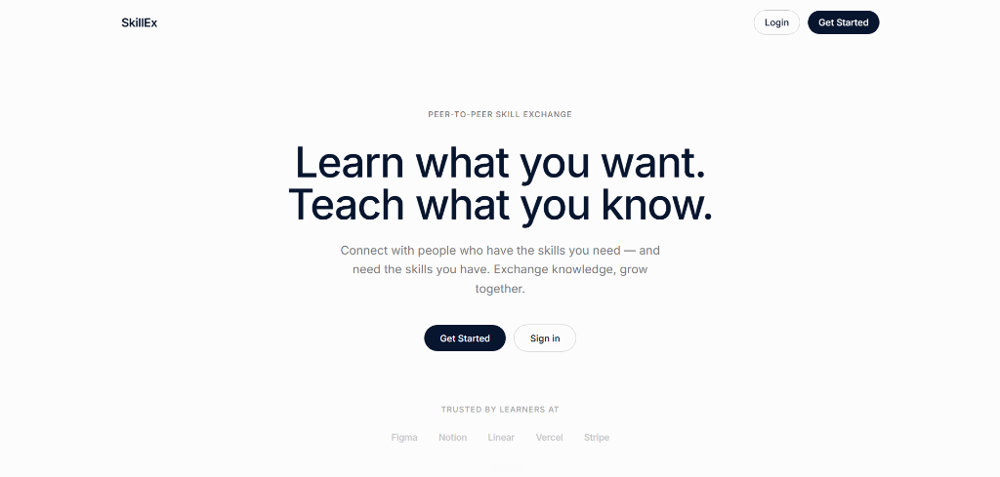

# Skill Exchange Platform

> A peer-to-peer network matching users by complementary skills, offering live messaging and video sessions with a fully collaborative whiteboard to facilitate remote learning.




## Why This Exists

Finding a mentor or peer to trade skills with (e.g., teaching Spanish in exchange for learning JavaScript) is challenging because matching complementary interests requires a specialized platform. This application solves that by deterministically matching users based on the specific skills they can teach and want to learn. It provides end-to-end tooling to connect, chat, and jump into a private WebRTC video room equipped with a robust collaborative whiteboard—eliminating the need to juggle third-party messaging and video conferencing apps.

## Features

### Skill Matching & Discovery
- **Profile Management:** Users can define specific skills they offer to teach and those they wish to learn.
- **Deterministic Discovery:** The platform calculates a match score to find users whose needs and offerings directly complement yours.
- **Connection Status:** Instantly see if you are already connected or have a pending exchange request with a candidate right on the discovery feed.

### Connections & Messaging
- **Exchange Requests:** Send requests to matches, and accept or reject incoming skill exchange requests.
- **Real-Time Chat:** A dedicated messaging view for every accepted connection, synced via Socket.io.
- **Conversation Cleanup:** Users can manually clear their message history or delete old/inactive exchange requests.
- **Quick Video Access:** A shortcut in the chat UI allows jumping straight into a video room with your connection.

### Live Video Sessions
- **Peer-to-Peer Video/Audio:** One-to-one secure media streams powered by WebRTC.
- **Hardware Management:** Camera and microphone access is explicitly requested only when turning them on, and cleanly released when turned off or upon exiting.
- **Local Recording:** Native browser recording of the video session via the `MediaRecorder` API, downloaded directly to your machine.
- **Full-Screen Mode:** Toggle full-screen for an immersive teaching experience.

### Collaborative Whiteboard
- **Synced Drawing Tools:** Freehand pen, object eraser, line, arrow, rectangle, circle, and text tools.
- **Object-Based Canvas:** Every stroke and shape is stored as an object, allowing accurate hit-testing to erase specific elements without wiping the whole board.
- **Robust Undo/Redo:** A per-user action history lets you undo/redo your own strokes and shapes without disrupting your peer's work.
- **Image/Screenshot Import:** Drop images onto the board, move them around, or resize them.
- **Recently Deleted Panel:** Restore accidentally deleted images, or permanently scrub them from the session for both participants.

### Account & Privacy
- **Secure Authentication:** JWT-based authentication via HTTP-only cookies and bcrypt password hashing.
- **Account Deletion:** Users can permanently delete their accounts and wipe all associated data from the platform.

## Tech Stack

| Layer | Technology |
| --- | --- |
| **Frontend** | React 18, React Router DOM, Tailwind CSS, Lucide React, Vite |
| **Backend** | Node.js, Express.js 5 |
| **Database** | MongoDB Atlas, Mongoose |
| **Realtime** | Socket.io |
| **Auth** | JWT, bcrypt, express-validator |
| **Media** | WebRTC, HTML5 Canvas API |

## Architecture (Signaling & Realtime)

The live room feature utilizes WebRTC for direct, peer-to-peer video and audio streams. Because WebRTC requires peers to exchange connection metadata (offers, answers, and ICE candidates) before establishing a direct connection, **Socket.io** is used as the signaling server. This hybrid pattern means that media streams flow directly between the two users and never touch the Node.js backend, minimizing server bandwidth. The Socket.io connection is only used to relay signaling messages and reliably synchronize the collaborative whiteboard events.

## Getting Started

### Prerequisites
- Node.js (v18 or higher recommended)
- A MongoDB Atlas account and a valid cluster connection string

### 1. Clone the Repository
```bash
git clone https://github.com/your-username/skill-exchange-platform.git
cd skill-exchange-platform
```

### 2. Setup the Server
Navigate to the `server` directory and install dependencies:
```bash
cd server
npm install
```

Create a `.env` file based on `.env.example`:
```bash
cp .env.example .env
```

**Required Environment Variables (`server/.env`)**
| Variable | Description | Example Value |
| --- | --- | --- |
| `PORT` | The port the backend runs on | `5000` |
| `MONGODB_URI` | Your MongoDB Atlas connection string | `mongodb+srv://<user>:<pw>@cluster0...` |
| `JWT_SECRET` | Secret key for signing JWTs | `super_secret_jwt_key_replace_me` |
| `NODE_ENV` | Environment mode | `development` |
| `CLIENT_URL` | The URL of the frontend app for CORS | `http://localhost:5173` |

### 3. Setup the Client
Open a new terminal, navigate to the `client` directory, and install dependencies:
```bash
cd client
npm install
```

### 4. Run the Development Servers
In the `server` directory, start the Express backend (runs with nodemon):
```bash
npm run dev
```

In the `client` directory, start the Vite development server:
```bash
npm run dev
```

### 5. Seed Demo Accounts (Optional)
To quickly test the matching algorithm, chat, and room logic, you can seed two complementary demo accounts (Rahul and Arjun). From the `server` directory, run:
```bash
npm run seed:demo
```
*You can then log in on two separate browsers as `rahul@demo.com` and `arjun@demo.com` with the password `demo1234`.*

## Project Structure

```text
skill-exchange-platform/
├── client/
│   ├── src/
│   │   ├── api/            # Axios instance
│   │   ├── components/     # Reusable UI (Navbar, ChatPanel, etc.)
│   │   ├── context/        # Auth Context
│   │   └── pages/          # React views (Dashboard, Discover, ChatView, Room, etc.)
│   ├── package.json
│   └── vite.config.js
└── server/
    ├── config/             # DB connection logic
    ├── middleware/         # Auth & validation middleware
    ├── models/             # Mongoose schemas (User, ExchangeRequest, Message, etc.)
    ├── routes/             # REST API endpoints (auth, discover, messages, etc.)
    ├── seeders/            # Database seeding scripts
    ├── socket/             # Socket.io handlers
    ├── package.json
    └── server.js           # Express entry point
```

## Known Limitations

- **TURN Server Missing:** The application relies on free STUN servers. If both peers are behind symmetric NATs or strict firewalls, the WebRTC connection may fail because a fallback TURN server is not provided.
- **No Group Calls:** The room architecture and WebRTC mesh are currently hardcoded for exactly two participants.
- **No Cloud Recording:** Recordings rely purely on the browser's `MediaRecorder` API and are downloaded locally. If a browser tab crashes before the session ends, the recording is lost.
- **Basic Matching Algorithm:** Matching is strictly deterministic and based on exact database skill strings; there is no fuzzy semantic matching involved.

## License

*No license is currently specified for this repository. Please consider adding an open-source license (such as MIT) if you plan to share this publicly.*
